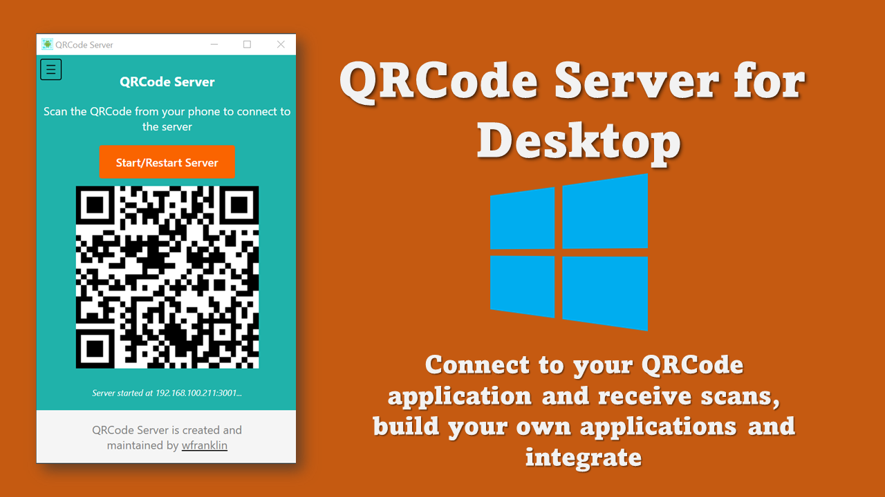

# QRCode Server

A simple server to compliment your QRCode mobile application. 
Receive scans made with your mobile device and perform additional actions.
Integrate with your different applications using methods provided.


# About QRCode Server



This simple application allows you to send QR code and Barcode scans to your computer.
You can perform special actions once the scan is received. You can then integrate with different applications.


## Features

* Portable Application
* Simple and Easy to use
* Quickly connect to server (Scan QRCode to connect mobile device)
* Receive scans to clipboard or save to file
* Implement actions once data is received
* Possible to integrate with other applications

## Installation

You can download this application from the Windows store or follow this link.

## Usage

Follow these simple steps.

* Open the application.
* Open the QRCode App on your mobile device.
* Scan the QRCode shown on the server. (Ensure your app says connected)
* Start sending scans to your computer.

## Special Thanks
Some open source application used are listed here.

## Integration Methods

In the settings menu the field `Parameter` allows you to enter the required text
to facility integration. This can be a command or a URL or a file path.

### Execute Command
You can enter a command for the application to take after it receives a scan
The `Parameter` label in settings will hold the command.

### Send to URL
You send your scans to different endpoints using either a POST or GET request.
The `Parameter` will old the URL that must be acted on.

For the GET request you just need to use the {message} wherever you want the scan to go.

```text
https://sampleapi.com?message={message}
```

For the POST request you can access the scan via the message field.
An example of this is shown for PHP. For other languages you can do something similar.
```php
$data = json_decode(file_get_contents("php://input"), true);
$scannedMessage = $data['message'];
```

### Write to File

You can either write to a file or append to the file.
The `Parameter` will old the file path for this action.

